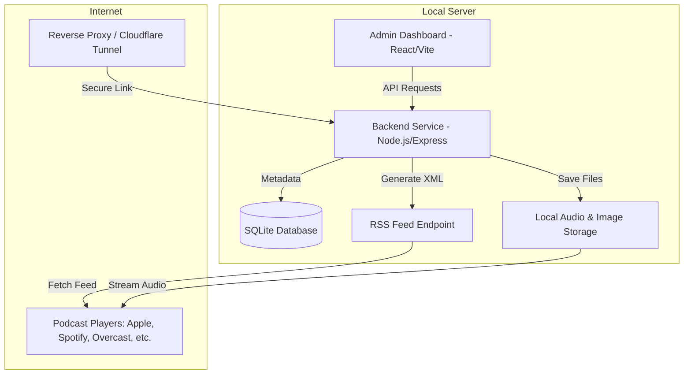

# Implementation Plan: Podcastarama - Self-Hosted Podcast Platform

We will build **Podcastarama**, a self-hosted, lightweight podcast management system. This platform allows you to host, manage, and distribute podcasts directly from your local server, keeping full ownership of your data and avoiding hosting fees.

## Overview & Architecture

To achieve this, the system consists of three main components:

1. **Backend Service (Node.js & Express & SQLite)**:
   - Manages episode and podcast metadata in a local SQLite database.
   - Provides a REST API for the Admin Dashboard (creating episodes, uploading files, editing settings).
   - Serves uploaded audio and image files over HTTP (supporting byte-range requests for seeking and resume-playback in podcast players).
   - Generates and serves an **iTunes-compliant RSS feed XML** containing all the necessary tags (categories, descriptions, artwork, audio enclosure links).
2. **Admin Dashboard (React, Vite, and Vanilla CSS)**:
   - A single-page application to manage your podcasts.
   - Features: Create/Edit podcast settings (Artwork, Title, Author, Language, Category), Upload new episodes, input show notes (rich text/Markdown), schedule publication, and track basic stats.
   - Built with high-fidelity custom styling, smooth animations, and interactive components.
3. **Local Storage**:
   - A dedicated folder on your disk where audio files (`.mp3`, `.m4a`) and image files (`.png`, `.jpg`) are organized and stored.

---

## User Review Required

> [!IMPORTANT]
> **Dynamic Network Access**: Because podcast players and directory indexers (like Spotify or Apple Podcasts) need to scrape your RSS feed and download the audio files, your local server must be accessible from the internet.
> 
> We recommend using **Cloudflare Tunnels (cloudflared)** because:
> 1. It is **free and secure**.
> 2. You do **not** need to open ports on your router (no port forwarding).
> 3. It automatically handles SSL certificates (HTTPS), which is required by many podcast aggregators.
> 
> *Alternatively*, you can use a custom domain with DDNS and an Nginx reverse proxy, but Cloudflare Tunnels are the easiest and most secure option. We will include guide notes for setting this up in the platform's documentation.

---

## Open Questions

> [!NOTE]
> 1. Do you have a preferred database? (SQLite is recommended for self-hosting since it requires zero setup and is stored in a single file).
> 2. What audio format do you plan to use? Standard `.mp3` is highly recommended for compatibility across all devices, but we can also support `.m4a` and others.
> 3. Would you like a multi-podcast manager (manage multiple shows from one dashboard) or a single-podcast manager? (We recommend a multi-podcast structure for future flexibility, even if you only run one show now).

---

## Proposed Changes

We will create a structured directory in your workspace `/home/debbie/code/podcastarama`:
- `backend/`: Node.js, Express, SQLite, RSS generation, and file uploads.
- `frontend/`: Vite-powered React app with beautiful CSS styling.
- `shared/`: Configs or schema defaults.

### Component: Backend Service

#### [NEW] [package.json](file:///home/debbie/code/podcastarama/backend/package.json)
Initialize backend dependencies: `express`, `sqlite3` or `better-sqlite3`, `multer` (for file uploads), `cors`, `dotenv`, and `xmlbuilder2` (for podcast RSS generation).

#### [NEW] [db.js](file:///home/debbie/code/podcastarama/backend/db.js)
Setup SQLite database schemas:
- `podcasts`: id, title, description, cover_url, author, email, category, language, website_url, explicit.
- `episodes`: id, podcast_id, title, description, audio_url, audio_size, audio_duration, publish_date, episode_number, season_number, explicit, status (draft/published).

#### [NEW] [rss.js](file:///home/debbie/code/podcastarama/backend/rss.js)
Logic to generate the iTunes-compatible XML feed for a given podcast. This includes converting the metadata and episode records into the RSS format.

#### [NEW] [server.js](file:///home/debbie/code/podcastarama/backend/server.js)
Core application setup:
- API routes for CRUD operations on podcasts and episodes.
- Audio and image upload handlers (saving to `/home/debbie/code/podcastarama/uploads/`).
- Static file serving with support for byte-range headers (crucial for iOS/Android podcast apps).

---

### Component: Admin Dashboard (Frontend)

#### [NEW] [index.html](file:///home/debbie/code/podcastarama/frontend/index.html)
Main Entrypoint with custom fonts (e.g., Outfit and Inter).

#### [NEW] [src/index.css](file:///home/debbie/code/podcastarama/frontend/src/index.css)
The design system foundation using CSS variables, custom scrollbars, sleek card layouts, transitions, gradients, and a modern dark mode interface.

#### [NEW] [src/App.jsx](file:///home/debbie/code/podcastarama/frontend/src/App.jsx)
The root component implementing layout routing:
- **Podcast List / Setup Page**: See all managed podcasts or create a new one.
- **Podcast Detail Page**: Show detailed information, lists of episodes, analytics metrics, and the public RSS Feed link.
- **Episode Editor**: Upload audio, set title, summary, season/episode numbers, and publishing options. Includes a file upload progress bar.

---

## Verification Plan

### Automated Tests
- We will set up automated health checks and RSS validator scripts.

### Manual Verification
- **RSS Validation**: Validate the generated RSS feed using the standard feed validator tools (e.g., [Cast Feed Validator](https://castfeedvalidator.com/)).
- **Audio Streaming Check**: Confirm that local audio files play correctly in browser players and allow seeking (verifying range requests are functional).
- **Upload Flow**: Test the multi-part upload of larger audio files and verify they are stored correctly in the local `uploads/` directory.
